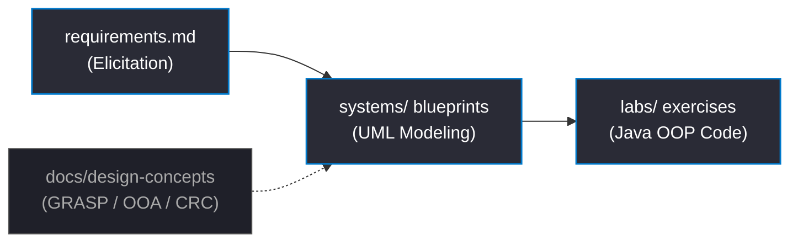

<div align="center">

# Software Design & Object-Oriented Modeling
**Low-Level Design (LLD) specifications, UML blueprints, and Java OOP implementations.**

[](https://www.oracle.com/java/)
[](https://plantuml.com)
[](https://en.wikipedia.org/wiki/GRASP_(object-oriented_design))
[](https://graphviz.org/)

</div>

---

### Project Metrics

```toml
[repository.metadata]
systems_designed = 7
specs_per_system = 8
total_java_parts = 8
total_uml_models = 56
implementation_status = "100% [████████████████████████████████████████]"

[design.patterns.applied]
grasp = ["Information Expert", "Creator", "Controller", "Low Coupling", "High Cohesion"]
solid = ["Single Responsibility (SRP)", "Open/Closed (OCP)", "Interface Segregation (ISP)"]
```

---

### Architecture & Implementation Pipeline

The repository models the complete software engineering lifecycle from requirements to verification:



---

### Repository Modules

<table width="100%">
  <tr>
    <td width="33.3%" valign="top">
      <h3>Systems</h3>
      <p>System case studies structured with detailed architectural specifications (UML & Graphviz DOT diagrams).</p>
      <a href="file:///c:/Users/nav6i/OneDrive/Documents/ics232/systems">Explore Systems →</a>
    </td>
    <td width="33.3%" valign="top">
      <h3>Labs</h3>
      <p>Practical Java exercises mapping core OOP concepts, multithreaded operations, and Swing desktop GUIs.</p>
      <a href="file:///c:/Users/nav6i/OneDrive/Documents/ics232/labs">Explore Labs →</a>
    </td>
    <td width="33.3%" valign="top">
      <h3>Docs</h3>
      <p>Theory notes on Object-Oriented Analysis classification, CRC cards, and GRASP design principles.</p>
      <a href="file:///c:/Users/nav6i/OneDrive/Documents/ics232/docs">Explore Docs →</a>
    </td>
  </tr>
</table>

---

### LLD Case Studies

| System Domain | Core Focus | Highlighted Specifications | Design Complexity |
| :--- | :--- | :--- | :--- |
| **Airline Reservation** | Logistics & Booking | Flight Lookup • Seat Reservation | `■■■■■■■■□□` (Medium-High) |
| **Supermarket System** | E-Commerce & Retail | Cart Checkout • Stock Levels | `■■■■■■■■□□` (Medium-High) |
| **Smart City System** | IoT & Infrastructure | Sensor Lights • Incident Routing | `■■■■■■■■■■` (High) |
| **Student Management** | Administration | Course Registration • Grading | `■■■■■■□□□□` (Medium) |
| **Railway Reservation** | Transit & Ticketing | Route Maps • PNR Status Tracking | `■■■■■■■■■■` (High) |
| **Point of Sale (POS)** | FinTech Transactions | Barcode Scans • Shift Reconciliation | `■■■■■■■■■■` (High) |
| **ATM System** | FinTech Hardware | PIN Encryption • Cash Dispensing | `■■■■■■■■■■` (High) |

#### The 8 Design Specifications in Each System Folder:
1.  **Use Case Diagram** — Boundary scopes and actor relationships.
2.  **Use Case Description** — Step-by-step main and alternative execution flows.
3.  **Class Diagram** — Attributes, operations, inheritance, and multiplicities.
4.  **Sequence Diagram** — Chronological call-stack message passing.
5.  **Collaboration Diagram** — Number-ordered object interactions (Graphviz DOT).
6.  **Activity Diagram (System)** — Main session workflow with swimlanes.
7.  **Activity Diagram (Detail)** — Granular step-by-step logic for a core action.
8.  **State Chart Diagram** — Complete object/session state transitions.

> [!NOTE]
> Detailed functional and non-functional requirements for all case studies are centralized in the [requirements.md](file:///c:/Users/nav6i/OneDrive/Documents/ics232/systems/requirements.md) file.

---

### Practical Implementations (`labs/`)

The exactly **8 laboratory parts** demonstrate progressive OOP implementation in Java:

*   **OOP Foundations**
    *   ↳ Constructors, `this` references, static caching, and member access controls.
*   **Structural Modularity**
    *   ↳ Abstract classes, interfaces, composition, and custom package routing.
*   **Concurrency & Execution**
    *   ↳ Multithreaded execution (Producer-Consumer synchronization, thread-based matrix sums).
*   **Data Collections**
    *   ↳ Bounded type generic methods, custom collection stack structures, and validation.
*   **GUI Systems**
    *   ↳ Event-driven desktop GUI layouts (Swing tables, login forms, calculators).

---

### Execution & Render Guides

<details>
<summary><b>Compiling & Running Java Modules</b></summary>

```bash
cd labs/lab-part1
javac BubbleSort.java
java BubbleSort
```
</details>

<details>
<summary><b>Rendering UML & DOT Architectures</b></summary>

*   **VS Code**: Install **PlantUML** (by *Jebbs*) and press `Alt + D` inside the `.md` diagram files.
*   **Web**: Copy and paste the PUML/DOT blocks into the [PlantUML Live Editor](https://www.plantuml.com/plantuml).
</details>
