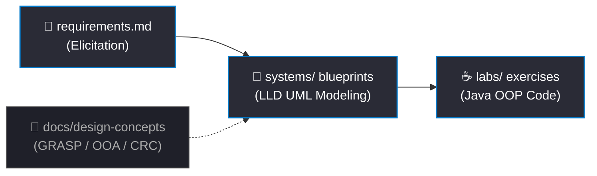

<div align="center">

# 📐 Software Design & Architecture Portfolio
**A modern Low-Level Design (LLD) showcase of UML architectural blueprints and Java OOP implementations.**

[](https://www.oracle.com/java/)
[](https://plantuml.com)
[](https://en.wikipedia.org/wiki/GRASP_(object-oriented_design))

</div>

---

### 🎨 Architecture & Implementation Pipeline

The repository models the complete software engineering lifecycle from requirements to verification:



---

### 📂 Repository Modules

<table width="100%">
  <tr>
    <td width="33.3%" valign="top">
      <h3>📐 Systems</h3>
      <p>7 system case studies, each mapped with 8 distinct UML structural & behavioral blueprints.</p>
      <a href="file:///c:/Users/nav6i/OneDrive/Documents/ics232/systems">Explore Systems →</a>
    </td>
    <td width="33.3%" valign="top">
      <h3>☕ Labs</h3>
      <p>8 practical Java modules covering multithreading, generic collections, and event-driven Swing desktop GUIs.</p>
      <a href="file:///c:/Users/nav6i/OneDrive/Documents/ics232/labs">Explore Labs →</a>
    </td>
    <td width="33.3%" valign="top">
      <h3>🧠 Docs</h3>
      <p>Theory notes on Object-Oriented Analysis classification, CRC cards, and GRASP design principles.</p>
      <a href="file:///c:/Users/nav6i/OneDrive/Documents/ics232/docs">Explore Docs →</a>
    </td>
  </tr>
</table>

---

### 🏛️ LLD Case Studies Matrix

| System Domain | Core Focus | UML Specifications |
| :--- | :--- | :--- |
| **✈️ Airline Reservation** | Logistics & Booking | Search Routing • Seat Allotment • Passenger Check-in |
| **🛒 Supermarket System** | E-Commerce & Retail | Cart Checkout • Payment Verification • Stock Levels |
| **🏙️ Smart City System** | IoT & Infrastructure | Sensor Streetlights • Incident Routing • Waste Pickups |
| **🎓 Student Management** | Administration | Course Registration • Transcript Generation • Timetables |
| **🚂 Railway Reservation** | Transit & Ticketing | Route Maps • PNR Status Tracking • Seat Upgrades |
| **💳 Point of Sale (POS)** | FinTech Transactions | Barcode Scans • Cashier Sessions • Shift Reconciliation |
| **🏧 ATM System** | FinTech Hardware | PIN Encryption • Cash Dispensing • Card Retention |

> [!NOTE]
> Detailed functional and non-functional requirements for all case studies are centralized in the [requirements.md](file:///c:/Users/nav6i/OneDrive/Documents/ics232/systems/requirements.md) file.

---

### 🛠️ Execution & Render Guides

<details>
<summary><b>▶ Compiling & Running Java Modules</b></summary>

```bash
cd labs/lab-part1
javac BubbleSort.java
java BubbleSort
```
</details>

<details>
<summary><b>▶ Rendering UML & DOT Architectures</b></summary>

*   **VS Code**: Install **PlantUML** (by *Jebbs*) and press `Alt + D` inside the `.md` diagram files.
*   **Web**: Copy and paste the PUML/DOT blocks into the [PlantUML Live Editor](https://www.plantuml.com/plantuml).
*   **Collaboration diagrams** are written in Graphviz DOT format wrapped in `@startdot` block tags.
</details>
